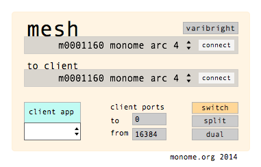

# mesh

mesh records live gestures into a large number of banks, allowing instant replay of past selves layered one upon another.

created by: trent gill (galapagoose)

http://vimeo.com/94991557

mesh allows you to capture any sequence of OSC messages as a gesture, stored and recalled from a monome grid. there are 63 nodes available for gestures, plus one function button (top-left) for clearing unwanted gestures.

mesh forwards all gesture input directly to the chosen client application (any serialosc capable monome application), and acts transparently when not playing back gestures.

example gestures can simply be a sequence of presses on the monome grid (either on the same, or a second attached grid), or movements / keypresses on an arc.

## quickstart

** before starting, you'll need to update to the latest [serialosc](https://github.com/monome/serialosc).** see [setup](http://monome.org/docs/setup/) for installation instructions.

* open the mesh application
* select your monome grid in the top serialosc dropdown
* open your 'client app' (the app you want to control)
* select your 'client app' prefix in the mesh window (bottom left)
* you can now play your client app as normal

## modes

mesh has 3 modes which are designed for different use cases and device sizes.

### switch
designed primarily for 64 key grids, this mode switches between the mesh and your client application. to switch, tap the top-right key to view the other page.

### split
currently supported by 128 only, this mode provides the mesh on the left 8x8 quadrant, and the client application on the right quadrant.

### dual
for use with multiple devices, the primary grid provides access to the mesh. a secondary device, attached under 'to client', communicates directly to the client application, though can be recorded into gesture nodes in mesh. the second device can be either a grid or arc device.

## in use
once you have selected a mode you can record a gesture
* arm a mesh node by pressing any key in the mesh
* the key will dimly light to show it is ready to record
* perform your gesture in the client application
* the key will fully light to show recording has begun
* press the node again to end the recording
* press the node again to trigger (and retrigger) the recorded gesture

only a single node can be armed at a given time. if a recording is currently underway when a new node is armed, the current recording will be stopped and saved, and the new recording will begin. this allows sequential gestures to be captured into separate nodes with a minimum of presses required.

in order to remove an unwanted recording:

* hold the top-left mesh button (the 'clear' key)
* press a lit node you wish to clear
* the node's led will deactivate and is now ready for a new gesture
